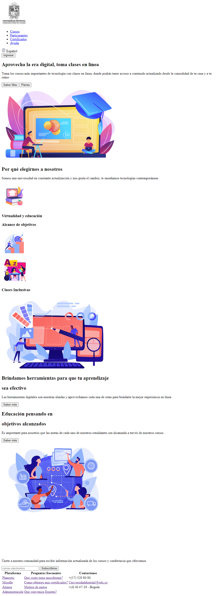
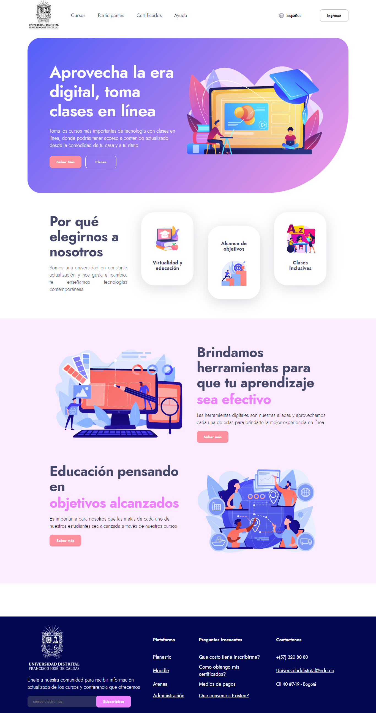
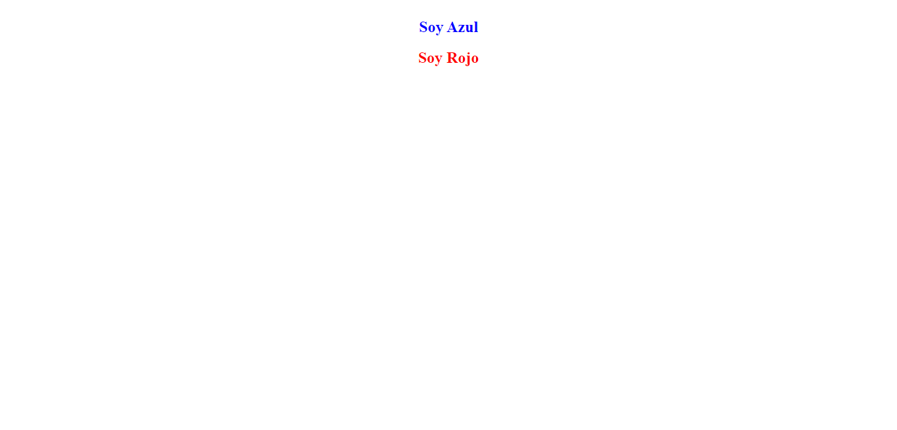
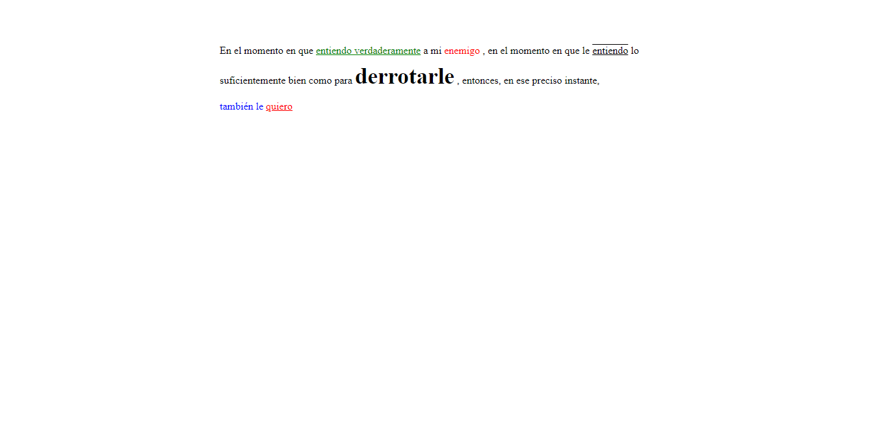
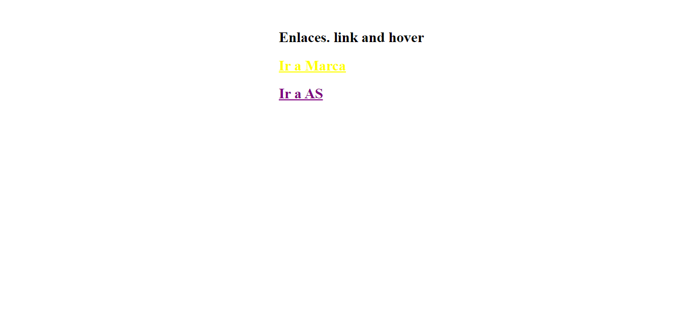

<h1>Taller 9: Adriana Barragan Marin</h1>

<h2>Información</2>

Curso: Full Stack Basico Grupo 1

Profesor: Cristian Patiño

<h2>Punto 1: Link de figma</h2>
<a href="https://www.figma.com/file/DaEujD4MsKESI7L8mvlz5q/Adriana-Barragan?type=design&node-id=0%3A1&t=8BhYXWllHuD4qMH8-1" target="-blank">Link de figma</a>

 
<a href= "https://adribama.github.io/taller-9-full-stack/">Link de pagina web</a>

<h2>Punto 2: HTML</h2>

<h2>Punto 3: CSS</h2>

<h2>Punto 4: HTML-CSS</h2>

<h2>Punto 5</h2>

<h2>Punto 6</h2>

<h2>Punto 7-8</h2>

